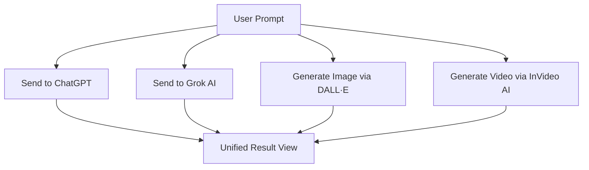

# ✨ AI Fusion – One Prompt. Endless Intelligence.

Here is a clean, beautiful, GitHub-style **README.md** description for your app **AI Fusion**, with proper Markdown formatting, bold text, sections, and developer-friendly styling:

---

# **✨ AI Fusion – One Prompt. Endless Intelligence.**

**AI Fusion** is an all-in-one multi-AI powerhouse that transforms a single prompt into:

* **Smart Text Responses** from *ChatGPT* and *Grok AI*
* **AI-Generated Images** powered by *DALL·E*
* **Instant Videos** created using *InVideo AI*

No more switching apps. No more inconsistent results.
Just one platform that fuses all leading AI engines to give you the *best* output—clearly, quickly, and beautifully.

---

## **🚀 Features**

### **🔹 1. Unified Prompt System**

Enter your query once—AI Fusion instantly sends it to all integrated AI systems.

### **🔹 2. Multi-AI Text Comparison**

Get side-by-side responses from:

* **ChatGPT**
* **Grok AI**

Perfect for research, writing, explanation comparison, and accuracy checks.

### **🔹 3. Image Generation with DALL·E**

Your prompt automatically generates a high-quality AI image using **DALL·E**, displayed directly in the app.

### **🔹 4. Video Generation with InVideo AI**

Turn your prompt into a complete **AI-generated video** using InVideo AI—ideal for presentations, social media, or creative projects.

### **🔹 5. Clean, Unified Dashboard**

All outputs—Text, Image, and Video—displayed in one beautiful interface, making comparison effortless.

---

## **🧠 How It Works**

---

## **🎯 Why AI Fusion?**

* ✔ **One app for all AI outputs**
* ✔ Eliminates switching between multiple platforms
* ✔ Helps find the *best* answer among multiple AI engines
* ✔ Combines text + image + video generation
* ✔ Saves time and boosts creativity

---

## **📂 Tech Stack**

* **Frontend:** React / Flutter (customizable)
* **Backend:** Node.js / Python APIs
* **AI Models Integrated:**

  * ChatGPT (OpenAI)
  * Grok AI
  * DALL·E Image Generation
  * InVideo AI for Video Creation

---

## **📸 Output Examples**

* **📝 Text:** Dual-AI comparison
* **🖼 Image:** DALL·E artwork
* **🎥 Video:** InVideo AI generated clip

---

## **🌟 Vision**

AI Fusion aims to become the ultimate AI command center—
a single space where creativity, knowledge, and automation come together.

---

## **📬 Contribute**

Want to improve AI Fusion?
Pull requests, ideas, and feedback are always welcome!

---
